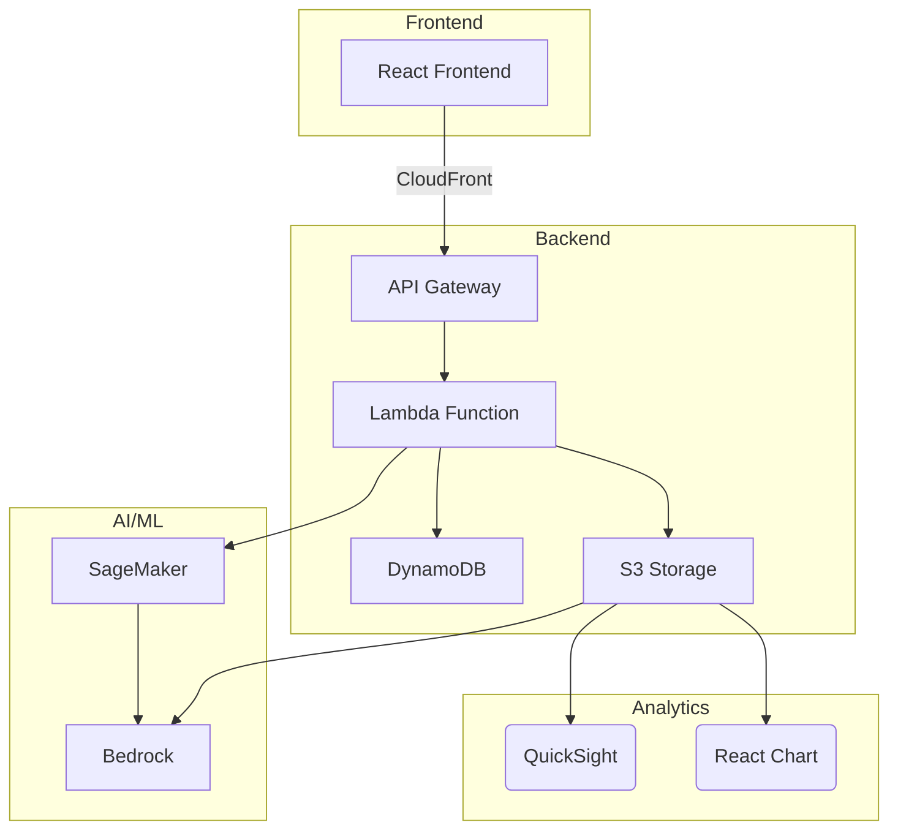

# 使用指南

這個專案旨在透過 AIGC 進行精準投放，需要搭配 [`product-image-generator-frontend`](https://github.com/jieyao-MilestoneHub/product-image-generator-frontend) 一起使用。

## 安裝和運行

1. 克隆倉庫：
    ```bash
    git clone <repository-url>
    ```

2. 進入專案目錄：
    ```bash
    cd product-image-generator-backend
    ```

3. 創建虛擬環境：
    ```bash
    python -m venv venv
    ```

4. 啟動虛擬環境：
    - Windows:
        ```bash
        .\venv\Scripts\activate
        ```
    - Unix 或 MacOS:
        ```bash
        source venv/bin/activate
        ```

5. 安裝依賴：
    ```bash
    pip install -r requirements.txt
    ```

6. 創建 `.env` 文件並將 AWS 金鑰放入：
    ```plaintext
    AWS_ACCESS_KEY_ID=your_access_key_id
    AWS_SECRET_ACCESS_KEY=your_secret_access_key
    S3_BUCKET_NAME=your_s3_bucket_name
    AWS_ROLE_ARN=your_aws_role_arn
    ```

7. 運行應用：
    ```bash
    uvicorn main:app --reload
    ```

8. 可以順利使用前端頁面。

## 歷史紀錄保存邏輯

1. **圖片上傳**：
    - 每次上傳圖片時，系統會將圖片保存到 S3 的 `static/{timestamp}/upload/` 目錄下，其中 `{timestamp}` 是圖片上傳的時間戳。
    - 在上傳圖片之前，系統會清理所有只有 `upload` 子目錄且沒有 `generated` 子目錄的舊時間戳目錄。

2. **生成圖片**：
    - 在生成圖片時，系統會從 S3 下載上傳的圖片，調用 BedrockClient 生成圖片，並將生成的圖片保存到 S3 的 `static/{timestamp}/generated/` 目錄下。
    - 如果生成圖片失敗，系統會刪除上傳的圖片。

3. **歷史紀錄保存**：
    - 每次生成圖片成功後，系統會將生成的圖片信息和項目信息保存到 `static/history_setting.json` 文件中，並上傳到 S3。
    - 歷史紀錄包括項目名稱、投放定向、上傳圖片文件名和生成圖片列表等信息。
    - 在調用歷史紀錄 API 時，系統會從 S3 下載 `history_setting.json` 文件，並返回其中的歷史紀錄信息。


## 雲端架構

